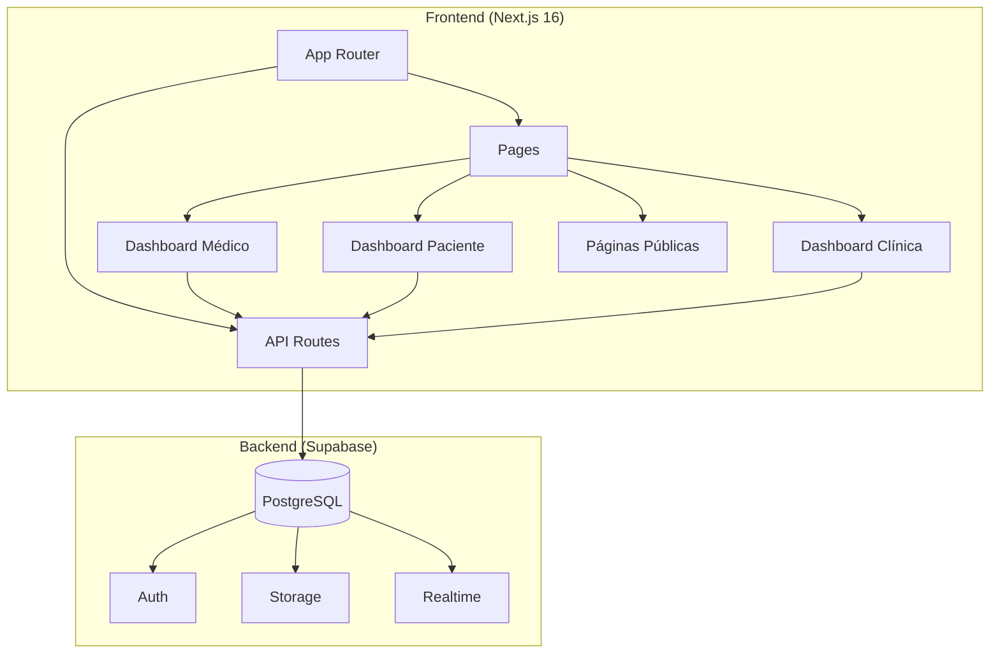
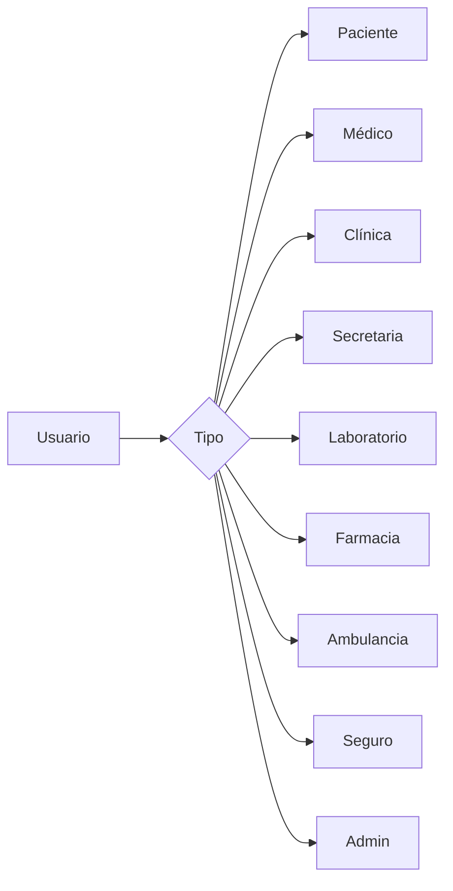
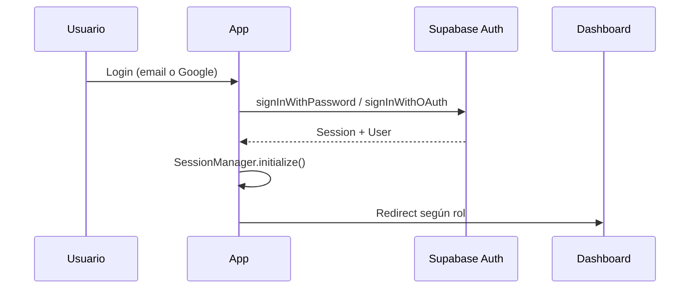

# 🏗️ Arquitectura del Sistema

## Visión General

Red-Salud es un SaaS médico multi-tenant con arquitectura basada en roles. Cada tipo de usuario tiene su propio dashboard y funcionalidades específicas.



## Estructura de Carpetas

### `/app` - Rutas (Next.js App Router)

| Carpeta | Descripción |
|---------|-------------|
| `(auth)/` | Login, registro, recuperación de contraseña |
| `(public)/` | Landing, servicios, precios, blog |
| `api/` | API routes para backend |
| `dashboard/` | Dashboards por rol |

### `/components` - Componentes React

| Carpeta | Descripción |
|---------|-------------|
| `ui/` | shadcn/ui (Button, Dialog, Card, etc.) |
| `dashboard/` | Componentes específicos de dashboards |
| `sections/` | Secciones de páginas públicas |
| `auth/` | Formularios y componentes de auth |
| `chatbot/` | Chatbot AI integrado |

### `/lib` - Servicios y Utilidades

| Carpeta | Descripción |
|---------|-------------|
| `supabase/` | Cliente, auth, services |
| `security/` | SessionManager, validaciones |
| `i18n/` | Traducciones |
| `constants/` | Configuraciones globales |

### `/hooks` - Custom Hooks

Hooks organizados por feature: `use-appointments`, `use-telemedicine`, `use-laboratory`, etc.

## Roles del Sistema



Cada rol tiene:
- Dashboard personalizado en `/dashboard/{rol}/`
- Permisos específicos en Supabase RLS
- Componentes y features exclusivos

## Flujo de Autenticación



### Componentes de Auth

- `SessionManager` (`lib/security/session-manager.ts`) - Gestión de sesiones
- `useSessionValidation` - Validación automática
- `SessionTimer` - Indicador visual de tiempo restante

## Decisiones de Arquitectura

### 1. App Router vs Pages Router
- **Decisión:** App Router (Next.js 13+)
- **Razón:** Server Components, layouts anidados, streaming

### 2. Supabase como Backend
- **Decisión:** Supabase (no backend custom)
- **Razón:** Auth integrado, RLS, realtime, storage sin config

### 3. shadcn/ui
- **Decisión:** shadcn/ui sobre otros UI kits
- **Razón:** Componentes copiables, full control, Tailwind nativo

### 4. Estado Global
- **Decisión:** Redux Toolkit + React Query
- **Razón:** Redux para UI state, React Query para server state

## Patrones Clave

### Service Pattern (lib/supabase/services/)
Cada entidad tiene su servicio que encapsula queries a Supabase.

```typescript
// lib/supabase/services/appointments-service.ts
export const appointmentsService = {
  getAll: async () => { /* ... */ },
  create: async (data) => { /* ... */ },
  update: async (id, data) => { /* ... */ },
}
```

### Hook Pattern (hooks/)
Cada feature tiene su hook que maneja estado y lógica.

```typescript
// hooks/use-appointments.ts
export function useAppointments() {
  const { data, isLoading } = useQuery(['appointments'], /* ... */)
  return { appointments: data, isLoading }
}
```
