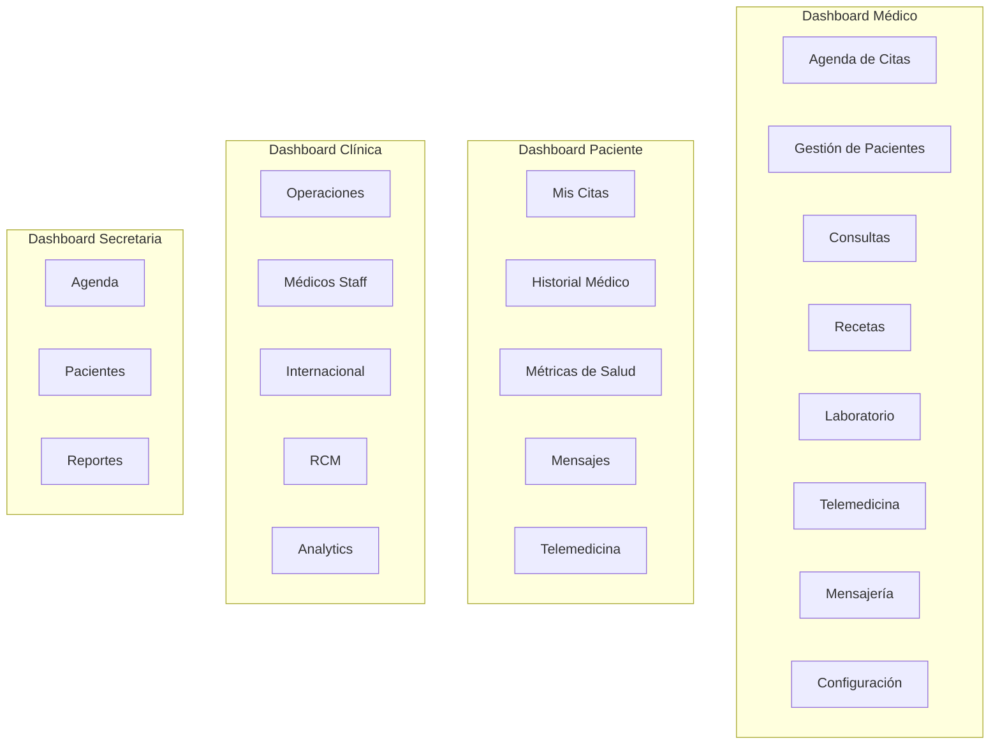

# ✨ Features Implementadas

## Visión General

Red-Salud tiene implementados los siguientes módulos por rol:

---

## 🩺 Dashboard Médico

### Agenda de Citas (`/dashboard/medico/citas`)
- **Vista de calendario:** Día, semana, mes
- **Drag & drop** para mover citas
- **Estados:** Programada, confirmada, en progreso, completada, cancelada
- **Filtros:** Por fecha, paciente, tipo de cita
- **Notificaciones:** Recordatorios de citas próximas

### Gestión de Pacientes (`/dashboard/medico/pacientes`)
- **Listado** con búsqueda y filtros
- **Perfil completo:** Datos personales, historial
- **Métricas:** Últimas consultas, medicamentos activos
- **Historial médico:** Diagnósticos, tratamientos

### Consultas (`/dashboard/medico/consultas`)
- **Formulario de consulta** con campos dinámicos
- **Notas clínicas** con autocompletado
- **Adjuntos:** Imágenes, documentos
- **Templates** personalizables

### Recetas (`/dashboard/medico/recetas`)
- **Generación de recetas** digitales
- **Base de medicamentos** con autocompletado
- **Historial de recetas** por paciente
- **QR code** para verificación

### Laboratorio (`/dashboard/medico/laboratorio`)
- **Solicitud de exámenes**
- **Resultados** con visualización de rangos
- **Historial de laboratorio**

### Telemedicina (`/dashboard/medico/telemedicina`)
- **Videollamadas** integradas
- **Sala de espera virtual**
- **Compartir pantalla**
- **Chat durante consulta**

### Configuración (`/dashboard/medico/configuracion`)
- **Perfil profesional:** Especialidad, bio, foto
- **Horarios de atención**
- **Templates de consulta**
- **Notificaciones**
- **Secretarias:** Asignar permisos

---

## 👤 Dashboard Paciente

### Mis Citas (`/dashboard/paciente/citas`)
- **Ver citas** programadas y pasadas
- **Solicitar nueva cita** con médico
- **Cancelar o reprogramar**
- **Unirse a videollamada**

### Historial Médico (`/dashboard/paciente/historial`)
- **Consultas pasadas**
- **Diagnósticos**
- **Tratamientos**
- **Documentos médicos**

### Métricas de Salud (`/dashboard/paciente/metricas`)
- **Registro de métricas:** Peso, presión, glucosa
- **Gráficos de evolución**
- **Alertas de valores fuera de rango**

---

## 🏥 Dashboard Clínica

### Operaciones (`/dashboard/clinica/operaciones`)
- **Panel de control** de la clínica
- **Staff management:** Médicos, secretarias
- **Agenda general**

### Internacional (`/dashboard/clinica/internacional`)
- **Turismo médico**
- **Pacientes internacionales**
- **Coordinación de viajes**

### RCM (Revenue Cycle Management) (`/dashboard/clinica/rcm`)
- **Facturación**
- **Cobros**
- **Reportes financieros**

---

## 👩‍💼 Dashboard Secretaria

### Gestión (`/dashboard/secretaria`)
- **Acceso a agenda** del médico asignado
- **Registro de pacientes**
- **Programación de citas**
- **Permisos configurables** por el médico

---

## 🔐 Sistema de Autenticación

### Métodos de Login
- **Email/Password** con validación
- **Google OAuth** integrado

### Gestión de Sesión
- **"Recordarme":** Sesión persistente vs temporal
- **Validación automática** cada 5 minutos
- **Timeout por inactividad** (configurable por rol)
- **Device fingerprinting**

### SessionTimer
- Indicador visual de tiempo restante
- Advertencia cuando quedan < 5 minutos
- Botón para extender sesión

---

## 🤖 Features Transversales

### Chatbot AI
- **Asistente contextual** basado en página actual
- **Respuestas sobre la aplicación**
- **Powered by Google Gemini**

### Tour Guide
- **Tours interactivos** por página
- **Highlights de elementos**
- **Progreso guardado**

### Notificaciones (Sonner)
- **Toast notifications**
- **Tipos:** Éxito, error, warning, info

### Dark Mode
- **Sistema de temas** completo
- **Persistencia** de preferencia
- **Diseño glassmorphism** en modo oscuro

### Internacionalización
- **Español** (idioma principal)
- **Estructura preparada** para más idiomas

---

## 📊 Visualizaciones

### Charts (Recharts)
- Gráficos de línea, barra, área
- Dashboards con métricas
- Reportes visuales

### 3D (Three.js)
- Widgets 3D en dashboard
- Visualizaciones de datos espaciales

---

## 🔮 Features Futuras (Roadmap)

- [ ] Laboratorio: Integración con laboratorios externos
- [ ] Farmacia: Dispensación de medicamentos
- [ ] Ambulancia: Servicio de emergencias
- [ ] Seguro: Integración con aseguradoras
- [ ] App móvil: React Native
